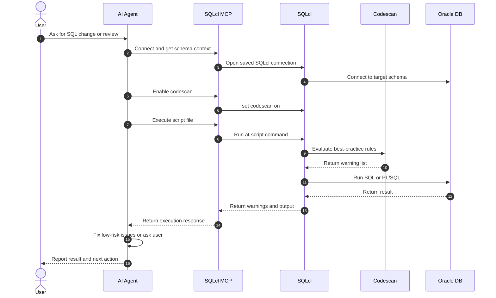

# oracle-sqlcl-mcp-trivadis-poc

Proof of concept for integrating SQLcl MCP execution with Trivadis guideline checks during AI-assisted SQL and PL/SQL iterations.

## POC Scope

- Show that SQLcl can surface Trivadis warnings inline during script execution when `set codescan on` is enabled.
- Show how an MCP-based agent can detect, interpret, and fix warnings in iterative workflows.
- Provide a small reusable documentation set for both humans and agents.

## Repository Contents

| Tree | Comments |
| --- | --- |
| `.` | Repository root for the proof of concept. |
| `|-- README.md` | Main overview, flow, prompts, and usage notes. |
| `|-- trivadis_warning_status.md` | One-row-per-file-and-rule warning tracking table. |
| `|-- docs/` | Human and agent workflow documentation. |
| `|   |-- ai_guidance.md` | MCP workflow guidance for automatic or assisted warning handling. |
| `|   \-- manual_trivadis_checks.md` | Standalone SQLcl steps for manual Trivadis checks. |
| `|-- examples/` | Minimal reproducible SQL example and its warning record. |
| `|   |-- select_from_dual_demo.sql` | Sample script with version comments and fixed warning. |
| `|   \-- select_from_dual_warning_record.md` | Warning capture and post-fix verification notes. |
| `\-- skills/` | Example skill definition for agent adoption. |
| `    \-- sqlcl_mcp_trivadis_agent_skill.md` | Skill behavior for SQLcl MCP plus Trivadis iterations. |

## How It Works

1. An agent or human prepares a SQL or PL/SQL script.
2. SQLcl MCP connects to Oracle using a saved SQLcl connection.
3. SQLcl session enables `set codescan on`.
4. The script runs with `@file.sql`.
5. SQLcl emits Trivadis warnings inline, if any exist.
6. The agent either fixes low-risk warnings automatically or asks the user to decide.
7. The script is re-run until warnings are fixed, accepted, or recorded.

## Sequence Diagram



## Example Prompts

Short prompt for a direct agent task:

```text
Use SQLcl MCP with Trivadis checks for this SQL change.
Connect with the saved SQLcl connection, fetch schema info, enable `set codescan on`, run the script with `@file.sql`, and treat Trivadis warnings as part of the iteration.
Fix low-risk warnings automatically, record the warning and fix in `trivadis_warning_status.md`, and ask me before making any change that could alter behavior or conventions.
```

Prompt for reviewing an existing SQL file:

```text
Review this SQL file with SQLcl MCP and Trivadis checks.
Connect with the saved SQLcl connection, enable `set codescan on`, execute the file with `@file.sql`, list any Trivadis warnings with rule numbers, fix safe issues automatically, and explain any warnings that still need user approval.
```

Prompt for a human who wants to guide the agent step by step:

```text
Use the SQLcl MCP Trivadis proof-of-concept workflow from this repository.
Show me each warning found for the script, propose the smallest correct fix, apply it only when low risk, and keep `trivadis_warning_status.md` updated.
```

## Standalone SQLcl Setup

If you want the manual flow to work outside MCP, make sure your local SQLcl supports codescan and enable it in the session before executing scripts.

Basic standalone flow:

```text
sql /nolog
connect my_saved_connection
set codescan on
@/absolute/path/to/your_script.sql
```

Optional folder-level scan:

```text
codescan -path /absolute/path/to/sql/files
```

More detail is in `docs/manual_trivadis_checks.md`.

## Key Rule

Inline Trivadis warnings are not emitted automatically just because a script is executed with `@file.sql`. The SQLcl session must enable `set codescan on`, or the operator must run an explicit `codescan -path ...` command.

## Related Files

- Start with `docs/manual_trivadis_checks.md` for human execution.
- Start with `docs/ai_guidance.md` and `skills/sqlcl_mcp_trivadis_agent_skill.md` for agent-driven workflows.
