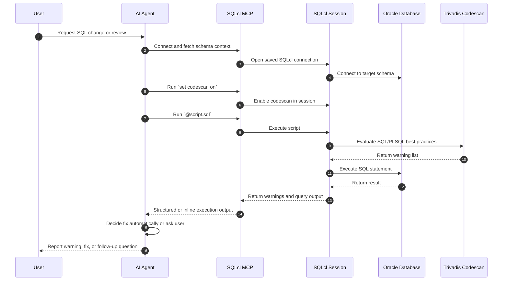

# oracle-sqlcl-mcp-trivadis-poc

Proof of concept for integrating SQLcl MCP execution with Trivadis guideline checks during AI-assisted SQL and PL/SQL iterations.

## POC Scope

- Show that SQLcl can surface Trivadis warnings inline during script execution when `set codescan on` is enabled.
- Show how an MCP-based agent can detect, interpret, and fix warnings in iterative workflows.
- Provide a small reusable documentation set for both humans and agents.

## Repository Contents

- `examples/select_from_dual_demo.sql`
  Minimal sample script with source-level version comments and a fixed Trivadis warning.
- `examples/select_from_dual_warning_record.md`
  Warning capture and fix verification for the sample script.
- `trivadis_warning_status.md`
  One-row-per-file-and-rule tracking table for detected and fixed warnings.
- `docs/ai_guidance.md`
  MCP workflow guidance for automatic or assisted warning handling.
- `docs/manual_trivadis_checks.md`
  Human-oriented SQLcl steps for checking a SQL file manually.
- `skills/sqlcl_mcp_trivadis_agent_skill.md`
  Example skill definition for an agent that should include this behavior.

## How It Works

1. An agent or human prepares a SQL or PL/SQL script.
2. SQLcl MCP connects to Oracle using a saved SQLcl connection.
3. SQLcl session enables `set codescan on`.
4. The script runs with `@file.sql`.
5. SQLcl emits Trivadis warnings inline, if any exist.
6. The agent either fixes low-risk warnings automatically or asks the user to decide.
7. The script is re-run until warnings are fixed, accepted, or recorded.

## Sequence Diagram



## Example Agent Prompt

```text
Use SQLcl MCP with Trivadis checks for this SQL change.
Connect with the saved SQLcl connection, fetch schema info, enable `set codescan on`, run the script with `@file.sql`, and treat Trivadis warnings as part of the iteration.
Fix low-risk warnings automatically, record the warning and fix in `trivadis_warning_status.md`, and ask me before making any change that could alter behavior or conventions.
```

## Key Rule

Inline Trivadis warnings are not emitted automatically just because a script is executed with `@file.sql`. The SQLcl session must enable `set codescan on`, or the operator must run an explicit `codescan -path ...` command.

## Related Files

- Start with `docs/manual_trivadis_checks.md` for human execution.
- Start with `docs/ai_guidance.md` and `skills/sqlcl_mcp_trivadis_agent_skill.md` for agent-driven workflows.
